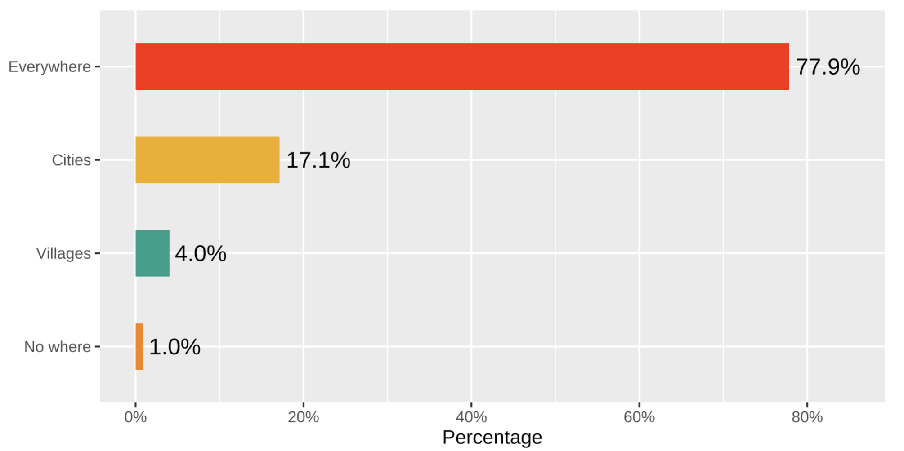
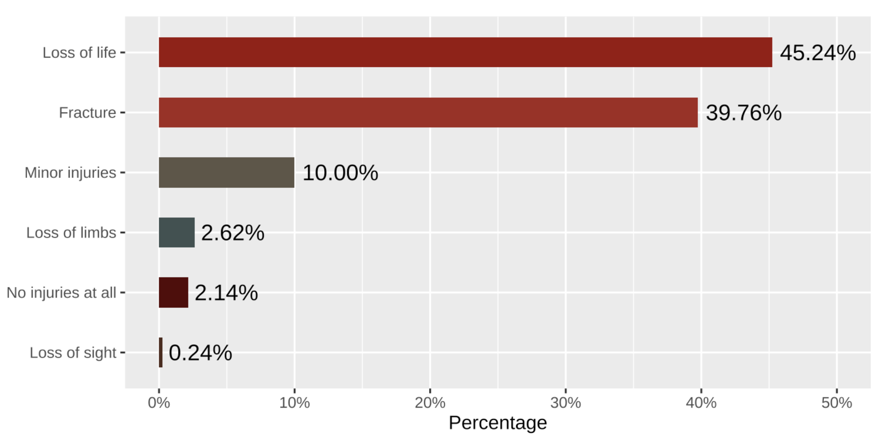
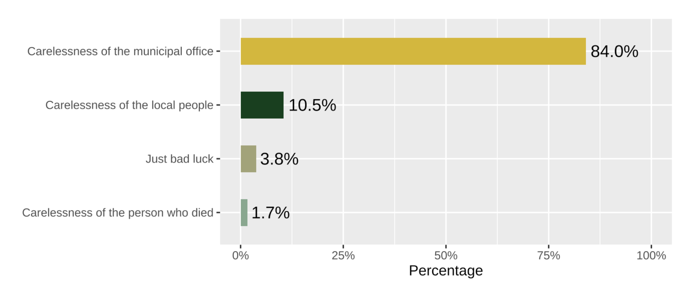

```{r setup, include=FALSE}
options(htmltools.dir.version = FALSE)
knitr::opts_chunk$set(collapse = TRUE,
                      fig.retina = 3,
                      echo = FALSE)

library(tinytex)
library(emojifont)
library(magick)
library(janitor)
library(wesanderson)
library(scales)
library(readr)
library(patchwork)
library(countdown)
library(ymlthis)
library(tidyverse)
library(magick)
library(icon)
library(xaringanExtra)
xaringanExtra::use_tachyons()
xaringanExtra::use_tile_view()
xaringanExtra::use_webcam()
xaringanExtra::use_fit_screen()
xaringanExtra::use_extra_styles(hover_code_line = TRUE, mute_unhighlighted_code = TRUE)
xaringanExtra::use_share_again()
xaringanExtra::use_editable(expires = 1)
xaringanExtra::use_panelset()
```

layout: true

---

class: title-slide, center, middle, hide-count

# `r rmarkdown::metadata$title`

## .orange[`r rmarkdown::metadata$subtitle`]

### `r rmarkdown::metadata$author` <br> `r format(Sys.Date(), "%d %B %Y") `

---

# Manhole`r emo::ji("light_bulb")`

`"Manhole acts as a collection point of several sewage pipes which are interconnected under the ground"`

--

```{r, echo = F, out.width="30%"}
library(knitr)
myimages<-list.files("images/news", pattern = ".png", full.names = TRUE)
include_graphics(myimages)
```

---

class: center

# Manhole Menace 

.panelset.sideways[
.panel[.panel-name[Clogging `r emo::ji("nauseated_face")`]

```{r clog-img1, echo=FALSE, out.width="50%"}
magick::image_read("images/clogging.jpg") 
```

.footenote[
Image credit: [gettyimages](https://www.gettyimages.in/detail/news-photo/an-indian-resident-try-to-free-a-clogged-manhole-as-news-photo/598023740)
]

]

.panel[.panel-name[Cleaning `r emo::ji("skull")`]

.pull-left[
```{r clean-img, echo=FALSE, out.width="100%"}
magick::image_read("images/man-mh.jpg") 
```

.footenote[
Image credit: [EPW](https://www.epw.in/system/files/pdf/2019_54/45/07_CSP_2850.jpg)
]

]

.pull-right[

.left["2,000 manual scavengers die every year in the sewers" <br>[Safai Karmachari Andolan, 2021](https://www.safaikarmachariandolan.org/crisis)]

]

]

.panel[.panel-name[Commuting `r emo::ji("face_with_head_bandage")`]

.pull-left[
```{r commuting-img, echo=FALSE, out.width="100%"}
magick::image_read("images/open-mh.jpeg") 
```

.footenote[
Image credit: [DNA](https://cdn.dnaindia.com/sites/default/files/styles/full/public/2018/06/22/696041-manhole-04.jpg)
]

]

.pull-right[
.left["In India, at least one person loses her/his life because of open pits and manholes every 12 hours with a staggering 5,393 such deaths recorded since 2015, including 841 in 2020." <br>[The Times of India, Nov 2021](http://timesofindia.indiatimes.com/articleshow/87917848.cms?utm_source=contentofinterest&utm_medium=text&utm_campaign=cppst)
]
]

]
]

---

# Manhole (MH) Menace Study 2019

- `Objective:` To comprehend the commuting menaces related to manholes in India

--

- `Methodology:` Online survey with sample size = 420

---

# .center[Open MHs are a major issue in:]

```{r out.width="95%", fig.align='center'}

```

---

# .center[Injuries due to falling in open MHs]

```{r out.width="95%", fig.align='center'}

```

---

# .center[Responsibility for deaths in open MHs]

```{r out.width="100%", fig.align='center'}

```

---
class: middle

.pull-left[

# Conclusions

- Clogging, Cleaning & Commuting

- Policy yes & public knowledge yes but implementation no.

]

.pull-right[
```{r , echo=FALSE, out.width="50%", fig.align='center'}
library(magick)
magick::image_read("images/ajaykoli.png") 
```

.center[`r icon::fa("twitter")`[@ajay_kolii](https://twitter.com/ajay_kolii) <br> 
`r icon::fa("envelope")`   [koliajaykumar@gmail.com](koliajaykumar@gmail.com)]

# .center[Thank you `r emo::ji("blush")`]
]